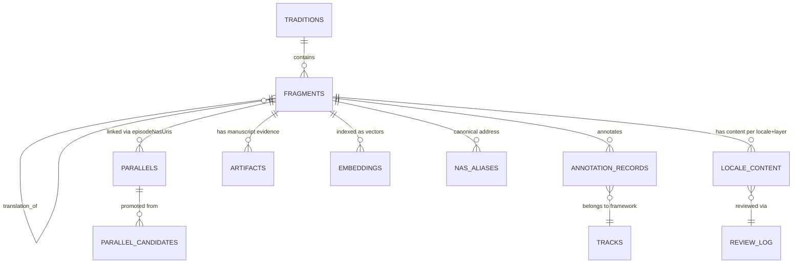
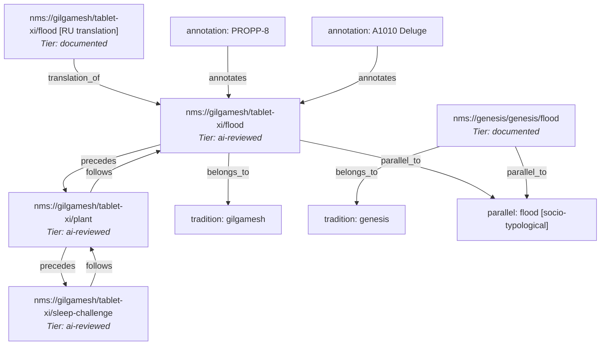
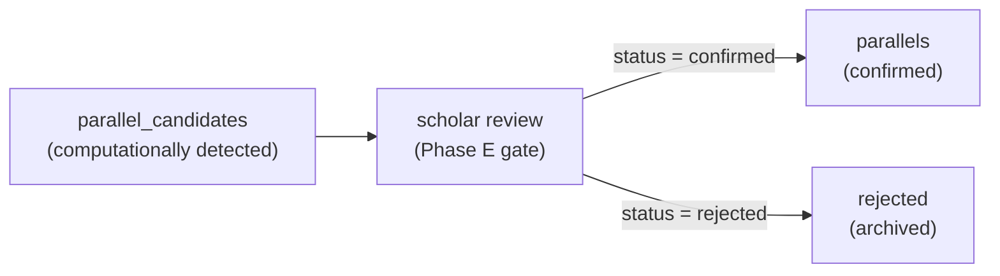
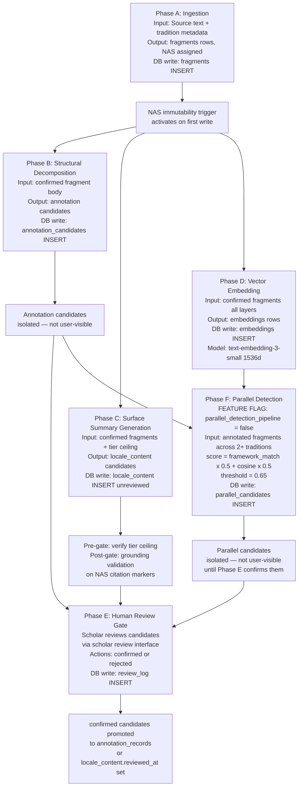

# Mnemosyne Engine — Data Architecture

**Phase 1 scope**: Epic of Gilgamesh + Biblical flood parallel, EN + RU locales.
**Status**: Draft — authoritative for production design decisions, pending Technical Lead sign-off on O-01 (graph store selection).

---

## Table of Contents

1. [Executive Overview](#1-executive-overview)
2. [Conceptual Model](#2-conceptual-model)
3. [Fragment Graph](#3-fragment-graph)
4. [NAS Addressing](#4-nas-addressing)
5. [Epistemic Tier System](#5-epistemic-tier-system)
6. [Onion Model Layers](#6-onion-model-layers)
7. [Current Prototype Schema](#7-current-prototype-schema)
8. [Episode Reader Content Model](#8-episode-reader-content-model)
9. [Parallel Network](#9-parallel-network)
10. [Annotation Tracks](#10-annotation-tracks)
11. [Localization Data Model](#11-localization-data-model)
12. [Artifacts and Manuscript Metadata](#12-artifacts-and-manuscript-metadata)
13. [Technology Recommendations](#13-technology-recommendations)
14. [Technology Comparison Matrix](#14-technology-comparison-matrix)
15. [Target Production Schema](#15-target-production-schema)
16. [Migration Path](#16-migration-path)
17. [Phase 1 vs Phase 2 Extension Points](#17-phase-1-vs-phase-2-extension-points)
18. [Data Integrity Rules](#18-data-integrity-rules)
19. [AI Pipeline Data Flow](#19-ai-pipeline-data-flow)

---

## 1. Executive Overview

The Mnemosyne Engine serves structured, epistemically disciplined access to humanity's epic traditions. Every visible content claim in the system traces to a Fragment — an atomic passage with a stable address, a confidence tier, and a tradition scope. That traceability is not a convention; it is a schema-level constraint.

Three architectural choices define the data layer:

**The Fragment Graph is the single source of truth.** Every search index, every API response, every UI render is a read or transformation of the Fragment Graph. No content exists outside it. This means the graph schema must be designed first; all other components derive from it.

**Epistemic tiers are DB constraints, not editorial guidelines.** A `CHECK` constraint on the `confidence_tier` column prevents a Fragment from being stored with an invalid tier. A trigger prevents NAS addresses from being mutated after first assignment. The system literally cannot serve content that bypasses these rules via a misbehaving pipeline step.

**Candidates are architecturally isolated.** Computationally-detected relationships — parallel suggestions, annotation candidates — live in physically separate tables never joined by public-facing queries. Users cannot encounter unreviewed algorithmic output through a query logic bug.

Phase 1 scope: ~600–700 Fragments, one tradition (Gilgamesh), one confirmed cross-tradition parallel (flood narrative), two interface locales (EN + RU). PostgreSQL with pgvector handles this scale with no architectural strain. The schema is designed with explicit Phase 2 extension points for additional traditions, character voice, and automated parallel detection — all feature-flagged to `false`.

---

## 2. Conceptual Model



**Key entities:**

| Entity | Role |
|---|---|
| `traditions` | Reference table for each epic tradition (gilgamesh, genesis, …) |
| `fragments` | Atomic passage nodes — NAS address, tier, tradition FK |
| `parallels` | Confirmed cross-tradition typed links |
| `parallel_candidates` | Computationally-detected parallel suggestions, isolated from public queries |
| `annotation_records` | Track annotations (Propp, Campbell, TMI, Bakhtin) linked to Fragments |
| `annotation_candidates` | Unreviewed annotation suggestions, isolated from public queries |
| `locale_content` | Per-(NAS, locale, layer) generated content — summaries, scholarly notes |
| `artifacts` | Manuscript images and institutional metadata |
| `embeddings` | pgvector index entries per (fragment, layer, locale, model) |
| `nas_aliases` | Immutable record of old NAS addresses after boundary changes |
| `review_log` | Audit trail for all candidate review decisions |
| `feature_flags` | System-level Phase 2+ feature gates, all default `false` |

---

## 3. Fragment Graph

The Fragment Graph is the primary data structure. Fragments are nodes; typed relationships are directed edges. All other system components are reads or transformations of this graph.



### Edge type definitions

| Edge type | Source | Target | Meaning | Stored as |
|---|---|---|---|---|
| `belongs_to` | Fragment | Tradition | Structural containment within a tradition | FK column `fragments.tradition_id` — not in `fragment_edges` |
| `precedes` | Fragment | Fragment | Sequential ordering within a tradition (write direction) | `fragment_edges` row |
| `follows` | Fragment | Fragment | Sequential ordering — inverse of `precedes` | `fragment_edges` row |
| `contains` | Episode-Fragment | Verse-Fragment | An episode node contains constituent verse/passage nodes | `fragment_edges` row |
| `parallel_to` | Fragment | Parallel | Fragment participates in a confirmed cross-tradition parallel (human-confirmed only) | `fragment_edges` row (with `parallel_id` FK) |
| `annotates` | AnnotationRecord | Fragment | A structural annotation is attached to a Fragment | FK column `annotation_records.fragment_nas` — not in `fragment_edges` |
| `translation_of` | Fragment | Fragment | A translated Fragment's source; the translation IS a Fragment | FK column `fragments.translation_of` — not in `fragment_edges` |

`belongs_to`, `translation_of`, and `annotates` are stored as FK columns on their respective tables rather than as rows in `fragment_edges`. Duplicating them in the edge table would create consistency obligations without traversal benefit at Phase 1 scale. The `fragment_edges` table stores the three traversal-relevant edges: `precedes`, `follows`, `contains`, and `parallel_to`.

### Graph storage strategy

Phase 1 implements the Fragment Graph in PostgreSQL using adjacency tables (not a native graph database). Traversal depth in Phase 1 is bounded to 3 hops (Fragment → Parallel → Fragment, Fragment → Translation → Fragment). This is well within PostgreSQL's recursive CTE performance envelope at Phase 1 scale.

The `fragment_edges` table stores all edge types with a discriminator column. Phase 2 escalation criteria for a native graph database: if traversal queries at 4+ hops with > 5,000 node traversals show > 200ms p95 latency in production. See §14 for technology comparison.

---

## 4. NAS Addressing

### Specification

The Narrative Address System (NAS) provides a stable, human-readable URI for every Fragment:

```
nms://{tradition}/{division-1}/{division-2}/{unit}
```

NAS is equivalent to a DOI system for narrative units: stable across time, citable in external scholarship, deep-linkable in perpetuity.

### Segment semantics

| Segment | Example | Meaning |
|---|---|---|
| `tradition` | `gilgamesh` | Lowercase tradition slug — matches `traditions.slug` FK |
| `division-1` | `tablet-xi` | Primary structural division (tablet, book, chapter) |
| `division-2` | `flood` | Named episode or section within the division |
| `unit` | `ark-dimensions` | Optional: named verse or passage within an episode |

### Examples

| NAS | Meaning |
|---|---|
| `nms://gilgamesh/tablet-xi/flood` | The flood episode of Tablet XI (episode-level) |
| `nms://genesis/chapter-07/flood/ark-dimensions` | Named verse within Genesis 7 |
| `nms://gilgamesh/tablet-viii/grief` | The Enkidu lament episode |
| `nms://iliad/book-xxiv/ransom-of-hector` | Ransom of Hector episode |

**Prototype note**: all current NAS addresses in the prototype are 3-segment (episode-level). The 4-segment `/unit` form is used in PRD examples but has not yet been assigned in prototype content. The production schema stores NAS as a single `TEXT` column capable of holding either form; there is no schema enforcement of segment count.

### Write-once semantics

NAS addresses are assigned once, on first ingestion. They do not change. This property is enforced by a PostgreSQL `BEFORE UPDATE` trigger:

```sql
CREATE OR REPLACE FUNCTION nas_immutability_guard()
RETURNS TRIGGER LANGUAGE plpgsql AS $$
BEGIN
  IF OLD.nas IS DISTINCT FROM NEW.nas THEN
    RAISE EXCEPTION 'NAS address is write-once. Old: %, Attempted: %', OLD.nas, NEW.nas;
  END IF;
  RETURN NEW;
END;
$$;

CREATE TRIGGER trg_nas_immutable
  BEFORE UPDATE ON fragments
  FOR EACH ROW EXECUTE FUNCTION nas_immutability_guard();
```

### Boundary change protocol

When scholarly consensus redraws structural boundaries (e.g., a previously single episode is split into two):

1. The old NAS address is registered in `nas_aliases(old_nas, current_nas, changed_at, reason)`.
2. New NAS addresses are assigned to the split fragments.
3. All external citations to the old NAS remain resolvable via the alias table.
4. The `fragments.nas` column for the affected record is never modified (trigger would reject it anyway).

### Locale neutrality

NAS addresses never carry a locale segment. `nms://gilgamesh/tablet-xi/flood` identifies the same narrative unit across EN and RU interface locales. Locale appears only in:
- URL path prefixes (`/en/...`, `/ru/...`)
- `locale_content.locale` column
- Interface string catalogs

---

## 5. Epistemic Tier System

### Four tiers

| Tier | DB value | PRD label | Meaning |
|---|---|---|---|
| 1 | `documented` | Documented | Primary source evidence; strong scholarly consensus |
| 2 | `reconstructed` | Reconstructed | Inferred from partial evidence; scholarly consensus but indirect |
| 3 | `contested` | Contested | Actively debated; multiple scholarly positions with evidence |
| 4 | `ai-reviewed` | Inspired (PRD) | AI-generated, reviewed by a scholar; limited evidential basis; disclosed as interpretive |

**PRD divergence**: the PRD names Tier 4 "Inspired." The prototype uses `ai-reviewed` as the DB/schema value for the same tier. This document uses `ai-reviewed` to match the current prototype schema. The production schema may adopt `inspired` as the canonical enum value — a team decision, not a schema constraint.

### DB-level enforcement

```sql
CREATE TYPE confidence_tier AS ENUM (
  'documented',
  'reconstructed',
  'contested',
  'ai-reviewed'
);
```

All tables that carry a `confidence_tier` column (`fragments`, `parallels`, `annotation_records`, `artifacts`) use this enum. PostgreSQL rejects any value not in the enum without application-layer involvement.

### Tier ceiling rule

A generated Fragment cannot be assigned a tier higher than the tier of its source fragments. This rule is enforced at the application layer (AI pipeline pre-gate) rather than as a pure DB constraint, because it requires reasoning over source Fragment tiers. The DB stores the result; the application enforces the ceiling before writing. See §19 for pipeline gate positions.

### Defense-in-depth tiers

Tier enforcement is layered:

1. PostgreSQL enum constraint — rejects invalid tier values at write
2. Application pre-gate — verifies source tier ceiling before generation
3. Application post-gate — grounding validation after generation; rejects if claims are ungrounded
4. ORM access control — `candidate` queries require explicit privilege
5. API resolver — cross-tradition claims without a `parallel_to` edge return structured error

---

## 6. Onion Model Layers

### Five layers

| Layer | Name | Content type | Phase 1? |
|---|---|---|---|
| 0 | Surface | AI-generated accessible summary (per locale, scholar-reviewed) | Yes |
| 1 | Narrated | Scholarly narrative prose with quoted passages | No (Phase 2) |
| 2 | Translated | Full translated passage with attribution | Yes |
| 3 | Original | Source text in original language (Akkadian, Hebrew, Greek…) | No (Phase 2) |
| 4 | Scholaria | Critical apparatus, manuscript variants, scholarly debate | Yes |

Phase 1 implements layers 0, 2, and 4. Layers 1 and 3 are designed for but not activated (feature flag `layer_1_narrated = false`, `layer_3_original = false`).

### Layer storage model

| Layer | Storage location | Per-locale? |
|---|---|---|
| 0 (Surface) | `locale_content(nas, locale, layer=0, body)` | Yes — generated per locale |
| 1 (Narrated) | `locale_content(nas, locale, layer=1, body)` | Yes — Phase 2 |
| 2 (Translated) | `fragments` table — a translated Fragment with `translation_of` FK and `language` column | Yes — the translation IS a Fragment |
| 3 (Original) | `fragments` table — source-language Fragment, no `translation_of` | No (single language) |
| 4 (Scholaria) | `locale_content(nas, locale, layer=4, body)` | Yes — primary EN, RU as variant |

**Key design point**: Layer 2 (Translated) content is modeled as a Fragment, not as a string field on the source Fragment. A Russian translation of Tablet XI is a separate Fragment with `translation_of` pointing to the source. This enables per-translation attribution, tier assignment, and NAS addressing. No architectural change is required to add new translations — they are additive Fragments.

### Prototype layer mapping

The prototype uses string enums in the `layers` array field: `'surface'` → Layer 0, `'translated'` → Layer 2, `'scholaria'` → Layer 4. The production schema uses numeric layer values (0, 1, 2, 3, 4) in the `locale_content.layer` column.

---

## 7. Current Prototype Schema

The prototype is a static Astro site using Content Collections with Zod schema validation. This section documents the schemas exactly as they exist, with notes on divergences from PRD intent.

### Epistemic tier enum

```typescript
// src/content.config.ts
export const EpistemicTierSchema = z.enum([
  'documented',    // Tier 1 — physically attested sources
  'reconstructed', // Tier 2 — scholarly reconstruction
  'contested',     // Tier 3 — contested interpretation
  'ai-reviewed',   // Tier 4 — AI-generated, scholar-reviewed
                   // PRD calls this "Inspired" — see §5 divergence note
]);
```

### Episodes collection schema

```typescript
// src/content.config.ts
const episodes = defineCollection({
  loader: glob({ pattern: '**/*.md', base: './src/content/episodes' }),
  schema: z.object({
    nas:       z.string(),          // NAS URI — write-once (convention only in prototype)
    tradition: z.enum([
      'gilgamesh', 'iliad', 'atrahasis', 'genesis',
      'mahabharata', 'ramayana', 'aeneid', 'shahnameh',
      'odyssey', 'tale-of-genji', 'beowulf', 'nibelungenlied', 'poetic-edda',
      'sundiata', 'kalevala', 'journey-to-the-west',
      'naruto', 'dune', 'warhammer-40k',
    ]),
    tablet:    z.string(),          // Division name — freeform string (e.g. "Tablet XI")
    tier:      EpistemicTierSchema,
    layers:    z.array(z.enum(['surface', 'translated', 'scholaria'])),
    parallelTo:       z.string().optional(),   // Denormalized NAS of parallel episode
    artifacts:        z.array(artifactSchema).optional(),
    proppFunctions:   z.array(proppFunctionSchema).optional(),
    campbellStages:   z.array(campbellStageSchema).optional(),  // ADDED beyond PRD scope
    tmiMotifs:        z.array(tmiMotifSchema).optional(),
    title_en:  z.string(),
    title_ru:  z.string(),
    desc_en:   z.string(),
    desc_ru:   z.string(),
    phase2:    z.boolean().default(false),
  }),
});
```

### Parallels collection schema

```typescript
const parallels = defineCollection({
  loader: glob({ pattern: '**/*.md', base: './src/content/parallels' }),
  schema: z.object({
    type: z.enum([
      'socio-typological',
      'literary-typological',
      'psychological-typological',
    ]),
    traditions:     z.array(z.string()).min(2),
    episodeNasUris: z.array(z.string()).min(2),
    tier:           EpistemicTierSchema,
    title_en:       z.string(),
    title_ru:       z.string(),
    // Scholarly notes are NOT in this schema — they live in en.ts / ru.ts
    // i18n string keys (e.g. parallel_view_note_what_p). See §8.
  }),
});
```

### Sub-schemas (annotation track items)

```typescript
const proppFunctionSchema = z.object({
  code:  z.string(),   // e.g. "PROPP-8"
  name:  z.string(),   // e.g. "Villainy / Lack"
  tier:  EpistemicTierSchema,
});

const campbellStageSchema = z.object({
  stage: z.string(),   // e.g. "Crossing the First Threshold"
  tier:  EpistemicTierSchema,
  // No `code` field — Campbell stages identified by name only in prototype
});

const tmiMotifSchema = z.object({
  code:  z.string(),   // e.g. "A1010"
  name:  z.string(),   // e.g. "Deluge"
  tier:  EpistemicTierSchema,
});

const artifactSchema = z.object({
  src:             z.string(),      // Asset path
  institution:     z.string(),
  accessionNumber: z.string(),
  license:         z.string(),      // e.g. "CC BY-NC-SA 4.0"
  tier:            EpistemicTierSchema,
  caption_en:      z.string(),
  caption_ru:      z.string(),
  viewUrl:         z.string().url().optional(),
});
```

### Active content inventory (Phase 1)

| Collection | Count | Notes |
|---|---|---|
| Episodes (full) | 7 | flood, grief-tablet-viii, ransom-of-hector, plant, sleep-challenge, mahabharata-arjunas-grief, mahabharata-krishna-counsel |
| Episodes (stubs) | ~15 | One stub per forthcoming tradition — `phase2: true` equivalent |
| Parallels | 3 | flood (gilgamesh↔genesis), grief (iliad↔gilgamesh), hero-crisis (mahabharata↔gilgamesh) |

### PRD vs. prototype divergences

| Aspect | PRD intent | Prototype reality | Resolution path |
|---|---|---|---|
| Tier 4 label | `inspired` | `ai-reviewed` | Decide canonical DB enum value before production schema deploy |
| Annotation tracks | Propp + Bakhtin + TMI | Propp + Campbell + TMI (Bakhtin is UI stub `inactive_track_bakhtin`) | **Open — Cultural Domain Expert decision**: retain Campbell as fourth track, restore Bakhtin, or both |
| Traditions in scope | Gilgamesh + flood parallel stubs | 19 traditions in enum, 3 confirmed parallels | Prototype has expanded beyond Phase 1 scope; production schema uses a `traditions` reference table not an enum |
| NAS immutability | Trigger-enforced | Convention only — no DB constraint | Trigger required before any production ingestion |
| NAS segment depth | Up to 4 segments | 3-segment episode-level addresses only | Production schema supports both; no enforcement of segment count |
| Division model | Structured — tablets as first-class | `tablet: z.string()` — freeform | Production schema adds `divisions(tradition_id, slug, label)` table |
| Parallel link model | Graph edge `parallel_to` | Denormalized `parallelTo` field on episode + separate `parallels` collection | Normalized in production via `fragment_edges` adjacency table |
| Candidate isolation | Physically separate tables | Not present — no candidate concept | `parallel_candidates` and `annotation_candidates` tables required |
| Per-locale Layer 0 | `locale_content` table, per locale | `desc_en` / `desc_ru` fields on episode + reader TS files | Migrate to `locale_content` in production |
| Bakhtin track schema | `bakhtinChronotopes` array | Not in Zod schema | Add to production `annotation_records` if team decides to activate |
| Parallel scholarly notes | Graph content entity | `en.ts`/`ru.ts` i18n keys | Migrate to `locale_content` with `layer=0, content_type='parallel_note'` |

---

## 8. Episode Reader Content Model

### Current prototype approach

Narrative prose and Scholaria content that is too rich for Markdown frontmatter lives in episode-specific TypeScript interfaces in `src/i18n/readers/`. These are locale-aware: each interface has implementations for EN and RU.

**`FloodReaderExtras`** (gilgamesh/tablet-xi/flood):

```typescript
interface FloodReaderExtras {
  // Narrated layer prose
  narrP1: string;          // Narrative paragraph 1
  narrP2: string;          // Narrative paragraph 2
  narrQuoteFenceHtml: string;  // Quoted passage (HTML)
  narrQuoteFenceCite: string;  // Citation for quote
  narrP3: string;
  narrQuoteSecretHtml: string;
  narrQuoteSecretCite: string;

  // Translated layer
  transSegments: FloodTransSeg[];  // Typed segments: p | verse | lacuna
  transAttribution: string;

  // Original language demo
  origHeadMain: string;
  origAttrGeorge: string;
  origAttrNineveh: string;
  origDemoNote: string;

  // Scholaria layer
  scholMs: string;           // Manuscript context
  scholHist: string;         // Historical context
  scholDebateHead: string;
  scholDebateP: string;
  scholVariantLine14: string;
  scholVariantLines4555: string;
  scholCite1_html: string;
  scholCite2_html: string;
  scholCite3_html: string;

  // Annotation panel content (Propp)
  proppFwTitle: string;
  proppFwBody: string;
  propp8Name: string;  propp8PanelHead: string;  propp8PanelP: string;
  // … one set per annotation

  // Annotation panel content (Campbell — added beyond PRD)
  campFwTitle: string;  campFwBody: string;
  campCrossName: string;  campCrossPanelHead: string;  campCrossPanelP: string;
  // …

  // Annotation panel content (TMI)
  tmiFwTitle: string;  tmiFwBody: string;
  tmiA1010Name: string;  tmiA1010PanelHead: string;  tmiA1010PanelP: string;
  // …
}
```

Parallel view scholarly notes follow the same pattern but are stored as keys in the main `Translations` interface in `en.ts`/`ru.ts` (e.g., `parallel_view_note_what_p`, `parallel_view_note_diverge_p1`).

### Why this works in the prototype but does not scale

The reader TS approach encodes narrative content as code. Adding a third locale or a new episode requires modifying TypeScript source files. Annotation panel body text is not addressable, not confidence-tiered, and not auditable. Parallel scholarly notes have no distinct type identity — they are string keys in the same catalog as navigation labels.

### Production equivalent

In production, all episode content lives in the database, addressed by NAS:

| Prototype storage | Production equivalent |
|---|---|
| `narrP1`, `narrP2` in reader TS | `locale_content(nas, locale, layer=1, body)` — Layer 1 Narrated (Phase 2) |
| `transSegments` in reader TS | Fragment with `translation_of` FK; body field; `TranslationSegment` JSONB |
| `scholMs`, `scholHist`, etc. | `locale_content(nas, locale, layer=4, body)` — Layer 4 Scholaria |
| Surface `desc_en`/`desc_ru` | `locale_content(nas, locale, layer=0, body)` |
| Annotation panel text | `annotation_records.panel_body_en`, `panel_body_ru` |
| Parallel view scholarly notes | `locale_content` with `content_type='parallel_note'`, linked via `parallel_id` |

The `locale_content` table captures the common pattern: a body of text scoped to a NAS address, a locale, a layer number, and a generation/review provenance chain.

---

## 9. Parallel Network

### Parallel types

| Type | Meaning |
|---|---|
| `socio-typological` | Structural resonance arising from shared social context or historical diffusion |
| `literary-typological` | Resonance in narrative form, motif structure, or compositional technique |
| `psychological-typological` | Resonance in universal psychological experience (grief, quest, mortality) |

Parallels are not derivation claims. A `literary-typological` parallel between Gilgamesh and Genesis does not assert borrowing. The type indicates the explanatory framework, not a genealogical claim.

### Confirmed vs. candidate distinction



**Confirmed parallels** live in the `parallels` table. Every query to the public API reads from `parallels` only.

**Parallel candidates** live in `parallel_candidates` — a physically separate table. There is no `status` column on the `parallels` table with a `'candidate'` value. This is not a soft constraint; the tables are structurally separate. A query bug cannot accidentally surface a candidate via a missing `WHERE status = 'confirmed'` clause.

### Current active parallels

| Parallel | Type | Traditions | Tier |
|---|---|---|---|
| Flood narrative | `socio-typological` | gilgamesh ↔ genesis | documented |
| Grief and the hero | `psychological-typological` | iliad ↔ gilgamesh | reconstructed |
| Hero in crisis | `psychological-typological` | mahabharata ↔ gilgamesh | reconstructed |

**Prototype note**: grief and hero-crisis parallels are beyond Phase 1 PRD scope. The PRD specifies one confirmed parallel (flood). The prototype has expanded to three. In production, all three must meet the scholar review gate before being served from the `parallels` table.

### Parallel scoring (Phase 2, feature flag = false)

Automated parallel detection is Phase 2. When active:

```
score = (framework_match_count / max_possible × 0.5) + (cosine_similarity × 0.5)
threshold = 0.65
```

A score ≥ 0.65 creates a `parallel_candidate` record for scholar review. The scoring weights and threshold are editorial content — they must be authored, attributed, and confidence-tiered like any scholarly claim.

---

## 10. Annotation Tracks

Tracks are independent annotation dimensions. No track is required for any Fragment. Tracks are composable: a Fragment can have Propp functions, TMI motifs, and Campbell stages independently. Track presence does not imply completeness.

### Track frameworks

| Framework | Code prefix | Scope | Phase 1? | Schema field |
|---|---|---|---|---|
| Propp Morphology | `PROPP-{N}` | Narrative function identification | Yes | `proppFunctions` |
| Thompson Motif Index | `{letter}{digits}` | Cross-cultural motif identification | Yes | `tmiMotifs` |
| Campbell Hero's Journey | (stage name string) | Monomyth stage mapping | Yes (prototype); PRD does not specify | `campbellStages` |
| Bakhtin Chronotopes | (chronotope name string) | Space-time narrative patterns | No — UI stub only | Not in current Zod schema |

**PRD divergence — Campbell vs. Bakhtin**: The PRD lists Propp, Bakhtin, and TMI as the three annotation frameworks. The prototype implements Propp, Campbell, and TMI instead. Bakhtin exists only as an `inactive_track_bakhtin` UI string with no schema support. Campbell was added beyond PRD scope.

**Open decision (Cultural Domain Expert)**: Does Campbell remain as the fourth track? Does Bakhtin replace or join it? This decision determines whether the production `annotation_records` table carries a Bakhtin discriminator value.

### Annotation record model

In the prototype, annotations are embedded arrays in episode frontmatter. In production, each annotation is a first-class record:

```
annotation_records(
  id,
  fragment_nas   → fragments.nas,
  framework      ENUM('propp', 'tmi', 'campbell', 'bakhtin'),
  code           TEXT,     -- "PROPP-8", "A1010", etc.
  name           TEXT,     -- human-readable label
  tier           confidence_tier,
  panel_body_en  TEXT,     -- explanatory text for annotation panel
  panel_body_ru  TEXT,
  reviewer_id    → users.id,
  reviewed_at    TIMESTAMPTZ
)
```

Annotation candidates (computationally suggested) live in `annotation_candidates` — physically separate from `annotation_records`.

### Track confidence tiers

Each annotation carries its own tier, independent of the Fragment tier. A Fragment may be `documented` while one of its Propp annotations is `reconstructed`. Tier enforcement applies per annotation record, not per Fragment.

---

## 11. Localization Data Model

### Three-layer architecture

| Layer | Content | Authorship | Per-locale generation? |
|---|---|---|---|
| A — Interface locale | UI strings, labels, navigation, badge text, error messages | Human — team | Authored per locale |
| B — AI content per locale | Surface (Layer 0) summaries, parallel scholarly notes | AI-generated, scholar-reviewed | Generated per locale (not translated) |
| C — Source-text translations | Layer 2 translated passages — each a Fragment with `translation_of` FK | Translation attribution per Fragment | Fragment per language |

### Layer A — Interface locale

727 strings in `Translations` interface. Fully duplicated in `en.ts` and `ru.ts`. TypeScript enforces parity: a missing key in either file is a compile error. This approach works well for Phase 1 scale. In production, interface strings migrate to a standard i18n catalog format (ICU MessageFormat or equivalent) for translator tooling integration.

### Layer B — AI content per locale

Surface summaries and parallel scholarly notes are generated per target locale from source fragments — not translated post-hoc from English. This preserves the grounding validation chain: NAS citation markers in the generated output are verifiable only if generation occurs in the target language.

Each locale variant of a summary is an independent candidate requiring independent scholar review and its own disclosure line: *AI-generated · Reviewed by [name] · [date]*.

Storage: `locale_content(nas, locale, layer, body, generated_by, reviewer_id, reviewed_at)`.

**Prototype reality**: Layer B content for the flood and grief episodes is currently stored in reader TypeScript files (`gilgameshTabletReaders.ts`). These are effectively pre-authored content, not AI-generated candidates. Migration to `locale_content` is part of the production transition (§16).

### Layer C — Source-text translations

Layer 2 translations are modeled as Fragments. A Russian translation of Tablet XI is a Fragment with:
- Its own NAS address: `nms://gilgamesh/tablet-xi/flood` (same NAS as source — the translation IS a rendering of the same narrative unit)
- `translation_of` edge pointing to the source Fragment
- `language` column: `'ru'`
- `tier`: per translation quality (`documented` for KJV, `reconstructed` for partial scholarly translations)

**Phase 1 Layer 2 scope**: EN translations only (Thompson 1930 for Gilgamesh, KJV for Genesis). RU Layer 2 is deferred pending resolution of O-05 (Diakonoff translation copyright).

### NAS locale neutrality (non-negotiable constraint)

`nms://gilgamesh/tablet-xi/flood` is the same unit regardless of interface locale. The NAS address does not change when a user switches locale. Locale appears in:
- URL path: `/en/gilgamesh/tablet-xi/flood` vs. `/ru/gilgamesh/tablet-xi/flood`
- `locale_content.locale` column
- UI string catalog keys

It never appears in NAS addresses.

### Locale routing

Phase 1 uses path-prefix locale routing: `/{locale}/{tradition}/{division}/{episode}`. Switching locale via the locale switcher preserves the current NAS address and navigates to the equivalent localized route.

---

## 12. Artifacts and Manuscript Metadata

Artifacts are physical manuscript objects associated with Fragments. They provide the evidentiary basis for `documented` tier claims.

### Artifact schema

| Field | Type | Description |
|---|---|---|
| `fragment_nas` | TEXT FK | The Fragment this artifact evidences |
| `src` | TEXT | Asset path or URL to image |
| `institution` | TEXT | Holding institution (e.g. "British Museum") |
| `accession_number` | TEXT | Institutional accession identifier (e.g. "K.3375") |
| `license` | TEXT | Reproduction license (e.g. "CC BY-NC-SA 4.0") |
| `tier` | confidence_tier | Epistemic tier of the artifact identification itself |
| `caption_en` | TEXT | EN descriptive caption |
| `caption_ru` | TEXT | RU descriptive caption |
| `view_url` | TEXT | External institutional viewer URL (nullable) |

### Example

```yaml
# nms://gilgamesh/tablet-xi/flood — K.3375
institution: British Museum
accessionNumber: "K.3375"
license: CC BY-NC-SA 4.0
tier: documented
caption_en: "Cuneiform tablet, Tablet XI of the Epic of Gilgamesh
  (Standard Babylonian Version). Neo-Assyrian period, 7th century BCE.
  Library of Ashurbanipal, Nineveh."
viewUrl: https://www.britishmuseum.org/collection/object/W_K-3375
```

### Storage

Phase 1: artifact image files in S3/R2 object storage. Database stores metadata only. The `src` field is a relative asset path (served via CDN) or a direct institutional URL.

Phase 2 extension point: `artifact_regions` table for sub-image coordinate annotations (e.g., highlighting specific lines of cuneiform). Feature flag `artifact_region_annotation = false`.

---

## 13. Technology Recommendations

### Primary store — PostgreSQL 16

**Recommendation**: PostgreSQL 16 with pgvector extension.

**Rationale**: Phase 1 scale (~600–700 Fragments) is well within PostgreSQL's comfortable envelope. The Fragment Graph at Phase 1 depth (≤3 hops) is efficiently served by recursive CTEs. pgvector provides the vector similarity search required for Phase F (parallel detection) and Life-Case Query without adding a second infrastructure dependency. PostgreSQL's JSONB type handles the `TranslationSegments` structured content without a separate schema.

**Phase 2 escalation criteria**: if traversal queries consistently exceed 3 hops with >5,000 node traversals at >200ms p95, evaluate Apache AGE (graph extension for PostgreSQL) before migrating to Neo4j. The migration path to Neo4j is cleanest from an adjacency table model — design for it but do not implement it.

### Vector store — pgvector (co-located)

**Recommendation**: pgvector extension in the primary PostgreSQL instance.

**Rationale**: Eliminates a separate deployment dependency. At Phase 1 scale (600–700 embeddings), pgvector's HNSW index (available since pgvector 0.5.0) provides sufficient ANN performance. Qdrant or Weaviate provide better performance at 100k+ vectors with heavy concurrent search, but the operational overhead is not justified at Phase 1 scale.

**Embedding strategy**:
- One embedding per (fragment, layer, locale, model) combination
- Phase 1: embed Layer 0 summaries (EN + RU) and Layer 2 translations (EN)
- Model: `text-embedding-3-small` (1536 dimensions) — good cost/quality for semantic narrative retrieval
- HNSW index: `ef_construction=128, m=16` — suitable for Phase 1 corpus size

**Phase 2 escalation criteria**: evaluate Qdrant if corpus exceeds 50k vectors or if multi-tenant search latency degrades below 50ms p95.

### Graph layer — PostgreSQL adjacency tables + recursive CTEs

**Recommendation**: implement the Fragment Graph as adjacency tables in PostgreSQL. Do not deploy a separate graph database in Phase 1.

**Rationale**: PRD §6.4 explicitly states this as the Phase 1 recommendation. The adjacency table + recursive CTE approach handles all Phase 1 traversal patterns without a separate deployment. See §14 for detailed comparison.

**Phase 2 note**: Apache AGE (PostgreSQL graph extension, Apache 2.0) enables Cypher queries directly in PostgreSQL without a separate deployment. This is the recommended Phase 2 upgrade path before considering Neo4j.

### Backend — Python/FastAPI modular monolith

**Recommendation**: Python 3.12 + FastAPI, modular monolith, 7 service modules.

Seven modules as defined in PRD §6.4:
1. Fragment Service — core graph operations
2. Ingestion Service — NAS assignment, content import
3. Annotation Service — structural annotation queue
4. Summary Service — Surface-layer generation (Anthropic Claude API)
5. Parallel Service — cross-tradition relationship management
6. Scholar Service — review interface, audit log
7. Public API — GraphQL read (Strawberry); REST write for scholars

**AI generation**: `claude-sonnet-4-6` via Anthropic Python SDK with prompt caching enabled. Surface summaries are generated with NAS citation markers in the prompt; the post-gate verifies citation survival.

### Async pipeline — Celery + Redis

**Recommendation**: Celery 5.x with Redis as broker.

Tasks: embedding generation (Phase D), summary generation (Phase C), parallel scoring (Phase F, feature-flagged). Redis also serves as the session cache for the scholar review interface.

### Content delivery — Astro static layer (Phase 1)

The current Astro prototype serves static pages. In production, the static layer is replaced by the Next.js frontend consuming the Public API. Phase 1 can continue as Astro static export if the FastAPI backend is not yet ready — the content migration to database (§16) is a prerequisite for production, not for continued prototype development.

### Object storage — Cloudflare R2 or AWS S3

**Recommendation**: Cloudflare R2 for Phase 1.

Zero egress cost is significant for serving manuscript artifact images. S3 is the fallback if AWS is the team's preferred infrastructure. Both serve identical interface; the difference is egress pricing.

---

## 14. Technology Comparison Matrix

### Primary data store

| Option | Graph traversal | Vector search | Deployment complexity | Phase 1 recommendation |
|---|---|---|---|---|
| PostgreSQL + pgvector | Recursive CTE — good to 3 hops | HNSW index via pgvector | Single service | **Recommended** |
| PostgreSQL + Apache AGE | Cypher queries — good to 5+ hops | pgvector same | Single service + extension | Phase 2 upgrade path |
| Neo4j | Native graph — excellent at any depth | Via Neo4j vector index | Separate deployment | Phase 3 if traversal demands it |
| ArangoDB | Multi-model: graph + document | Limited native vector | Separate deployment | Not recommended for Phase 1 |

### Vector store

| Option | Scale sweet spot | ANN algorithm | Deployment | Phase 1 recommendation |
|---|---|---|---|---|
| pgvector | <50k vectors | HNSW / IVFFlat | Co-located with Postgres | **Recommended** |
| Qdrant | 50k–10M vectors | HNSW | Separate service | Phase 2 if corpus grows |
| Weaviate | 100k+ vectors, multi-modal | HNSW | Separate service + schema | Phase 3 |
| Pinecone | Managed, any scale | Proprietary | External managed | Not recommended — vendor lock-in |

### Graph database

| Option | Query language | Traversal performance | NAS compatibility | Phase 1 recommendation |
|---|---|---|---|---|
| PostgreSQL adjacency tables | SQL + CTEs | Good ≤3 hops | Natural FK | **Recommended** |
| Apache AGE (PostgreSQL extension) | Cypher + SQL | Good ≤5 hops | Natural FK | Phase 2 upgrade |
| Neo4j | Cypher | Excellent | Property on node | Phase 3 if scale requires |
| RDF triplestore (e.g., Blazegraph) | SPARQL | Excellent for linked data | URI-native | Not recommended — highest complexity |

### Object storage

| Option | Egress cost | S3-compatible API | CDN integration | Phase 1 recommendation |
|---|---|---|---|---|
| Cloudflare R2 | Free egress | Yes | Cloudflare CDN native | **Recommended** |
| AWS S3 | Paid egress | Native | CloudFront | Fallback if AWS preferred |
| Backblaze B2 | Cheap egress | Yes | Cloudflare CDN compatible | Alternative to R2 |

---

## 15. Target Production Schema

Full PostgreSQL DDL for the Fragment Graph. All constraints, triggers, and indexes are production-ready.

### Traditions reference table

```sql
CREATE TABLE traditions (
  id          UUID PRIMARY KEY DEFAULT gen_random_uuid(),
  slug        TEXT NOT NULL UNIQUE,    -- e.g. 'gilgamesh', 'genesis'
  label_en    TEXT NOT NULL,
  label_ru    TEXT NOT NULL,
  status      TEXT NOT NULL DEFAULT 'stub'
                CHECK (status IN ('active', 'stub', 'archived')),
  phase       INTEGER NOT NULL DEFAULT 2,  -- phase of activation
  created_at  TIMESTAMPTZ NOT NULL DEFAULT NOW()
);

-- Phase 1 active traditions
-- INSERT INTO traditions (slug, label_en, label_ru, status, phase) VALUES
--   ('gilgamesh', 'Epic of Gilgamesh', 'Эпос о Гильгамеше', 'active', 1),
--   ('genesis',   'Genesis (Biblical)', 'Книга Бытия', 'active', 1);
```

### Divisions table

```sql
CREATE TABLE divisions (
  id           UUID PRIMARY KEY DEFAULT gen_random_uuid(),
  tradition_id UUID NOT NULL REFERENCES traditions(id),
  slug         TEXT NOT NULL,    -- e.g. 'tablet-xi'
  label        TEXT NOT NULL,    -- e.g. 'Tablet XI'
  ordinal      INTEGER,          -- display order
  UNIQUE (tradition_id, slug)
);
```

### Confidence tier type

```sql
CREATE TYPE confidence_tier AS ENUM (
  'documented',
  'reconstructed',
  'contested',
  'ai-reviewed'   -- equivalent to PRD "Inspired"; rename to 'inspired' is a team decision
);
```

### Fragments table

```sql
CREATE TABLE fragments (
  nas             TEXT PRIMARY KEY
                    CHECK (nas LIKE 'nms://%'),
  tradition_id    UUID NOT NULL REFERENCES traditions(id),
  division_id     UUID REFERENCES divisions(id),
  tier            confidence_tier NOT NULL,
  language        TEXT,          -- ISO 639-1, e.g. 'en', 'ru', 'akk' (Akkadian)
  translation_of  TEXT REFERENCES fragments(nas),
                    -- NULL if source fragment; non-null if translation
  body            TEXT,          -- Plain text body (stripped markup)
  body_html       TEXT,          -- HTML rendering for display
  trans_segments  JSONB,         -- Typed translation segments for Layer 2
  ordinal         INTEGER,       -- Sequence within division
  created_at      TIMESTAMPTZ NOT NULL DEFAULT NOW(),
  updated_at      TIMESTAMPTZ NOT NULL DEFAULT NOW(),
  CONSTRAINT no_self_translation CHECK (translation_of IS DISTINCT FROM nas)
);

-- NAS immutability trigger
CREATE OR REPLACE FUNCTION nas_immutability_guard()
RETURNS TRIGGER LANGUAGE plpgsql AS $$
BEGIN
  IF OLD.nas IS DISTINCT FROM NEW.nas THEN
    RAISE EXCEPTION
      'NAS is write-once. Existing: %, Attempted: %', OLD.nas, NEW.nas;
  END IF;
  RETURN NEW;
END;
$$;

CREATE TRIGGER trg_nas_immutable
  BEFORE UPDATE ON fragments
  FOR EACH ROW EXECUTE FUNCTION nas_immutability_guard();

-- Indexes
CREATE INDEX idx_fragments_tradition ON fragments (tradition_id);
CREATE INDEX idx_fragments_division  ON fragments (division_id);
CREATE INDEX idx_fragments_tier      ON fragments (tier);
CREATE INDEX idx_fragments_translation ON fragments (translation_of)
  WHERE translation_of IS NOT NULL;
```

### NAS aliases table

```sql
CREATE TABLE nas_aliases (
  old_nas     TEXT PRIMARY KEY CHECK (old_nas LIKE 'nms://%'),
  current_nas TEXT NOT NULL REFERENCES fragments(nas),
  changed_at  TIMESTAMPTZ NOT NULL DEFAULT NOW(),
  reason      TEXT NOT NULL    -- scholarly justification for boundary change
);
```

### Fragment edges (graph adjacency)

```sql
-- Note: 'belongs_to', 'translation_of', and 'annotates' are stored as FK columns
-- on their respective tables (fragments.tradition_id, fragments.translation_of,
-- annotation_records.fragment_nas). Only traversal-relevant edges are in fragment_edges.
CREATE TYPE edge_type AS ENUM (
  'precedes',
  'follows',
  'contains',
  'parallel_to'
);

CREATE TABLE fragment_edges (
  id          UUID PRIMARY KEY DEFAULT gen_random_uuid(),
  source_nas  TEXT NOT NULL REFERENCES fragments(nas),
  target_nas  TEXT REFERENCES fragments(nas),
  edge_type   edge_type NOT NULL,
  parallel_id UUID REFERENCES parallels(id) ON DELETE RESTRICT,
                             -- non-null when edge_type = 'parallel_to'
  metadata    JSONB,             -- edge-type-specific attributes
  created_at  TIMESTAMPTZ NOT NULL DEFAULT NOW()
);

CREATE INDEX idx_edges_source   ON fragment_edges (source_nas, edge_type);
CREATE INDEX idx_edges_target   ON fragment_edges (target_nas, edge_type);
CREATE INDEX idx_edges_parallel ON fragment_edges (parallel_id)
  WHERE parallel_id IS NOT NULL;
```

### Parallels table (confirmed only)

```sql
CREATE TABLE parallels (
  id              UUID PRIMARY KEY DEFAULT gen_random_uuid(),
  type            TEXT NOT NULL
                    CHECK (type IN (
                      'socio-typological',
                      'literary-typological',
                      'psychological-typological'
                    )),
  tier            confidence_tier NOT NULL,
  episode_nas_uris TEXT[] NOT NULL,  -- min 2 elements, validated at application layer
  traditions      TEXT[] NOT NULL,   -- tradition slugs
  reviewer_id     UUID NOT NULL,     -- who confirmed this parallel
  reviewed_at     TIMESTAMPTZ NOT NULL,
  created_at      TIMESTAMPTZ NOT NULL DEFAULT NOW()
);

CREATE INDEX idx_parallels_type ON parallels (type);
CREATE INDEX idx_parallels_tier ON parallels (tier);
CREATE INDEX idx_parallels_episode_uris ON parallels USING GIN (episode_nas_uris);
-- Required for: WHERE $1 = ANY(episode_nas_uris) — primary lookup pattern
```

### Parallel candidates (isolated — never joined by public queries)

```sql
CREATE TABLE parallel_candidates (
  id              UUID PRIMARY KEY DEFAULT gen_random_uuid(),
  episode_nas_uris TEXT[] NOT NULL,
  traditions      TEXT[] NOT NULL,
  score           NUMERIC(4,3) NOT NULL CHECK (score BETWEEN 0 AND 1),
  framework_score NUMERIC(4,3),
  cosine_score    NUMERIC(4,3),
  status          TEXT NOT NULL DEFAULT 'pending'
                    CHECK (status IN ('pending', 'confirmed', 'rejected')),
  reviewer_id     UUID,          -- NULL until reviewed
  reviewed_at     TIMESTAMPTZ,
  created_at      TIMESTAMPTZ NOT NULL DEFAULT NOW()
);

-- Row-level security: public API role cannot SELECT from this table
-- ALTER TABLE parallel_candidates ENABLE ROW LEVEL SECURITY;
-- CREATE POLICY candidate_isolation ON parallel_candidates
--   USING (current_setting('app.role') = 'scholar_api');
```

### Annotation records (confirmed track annotations)

```sql
CREATE TYPE annotation_framework AS ENUM (
  'propp',
  'tmi',
  'campbell',  -- added beyond PRD scope; remove if Cultural Expert decides against
  'bakhtin'    -- PRD-specified but not yet in prototype schema
);

CREATE TABLE annotation_records (
  id            UUID PRIMARY KEY DEFAULT gen_random_uuid(),
  fragment_nas  TEXT NOT NULL REFERENCES fragments(nas),
  framework     annotation_framework NOT NULL,
  code          TEXT,     -- "PROPP-8", "A1010"; NULL for name-only frameworks
  name          TEXT NOT NULL,
  tier          confidence_tier NOT NULL,
  panel_body_en TEXT,     -- annotation panel explanatory text
  panel_body_ru TEXT,
  reviewer_id   UUID NOT NULL,
  reviewed_at   TIMESTAMPTZ NOT NULL,
  created_at    TIMESTAMPTZ NOT NULL DEFAULT NOW()
);

CREATE INDEX idx_annot_fragment   ON annotation_records (fragment_nas);
CREATE INDEX idx_annot_framework  ON annotation_records (framework);
CREATE INDEX idx_annot_code       ON annotation_records (framework, code)
  WHERE code IS NOT NULL;
```

### Annotation candidates (isolated)

```sql
CREATE TABLE annotation_candidates (
  id            UUID PRIMARY KEY DEFAULT gen_random_uuid(),
  fragment_nas  TEXT NOT NULL REFERENCES fragments(nas),
  framework     annotation_framework NOT NULL,
  code          TEXT,
  name          TEXT NOT NULL,
  confidence    NUMERIC(4,3),
  status        TEXT NOT NULL DEFAULT 'pending'
                  CHECK (status IN ('pending', 'confirmed', 'rejected')),
  reviewer_id   UUID,
  reviewed_at   TIMESTAMPTZ,
  created_at    TIMESTAMPTZ NOT NULL DEFAULT NOW()
);
```

### Locale content (Layer B — AI-generated per locale)

```sql
CREATE TABLE locale_content (
  id             UUID PRIMARY KEY DEFAULT gen_random_uuid(),
  nas            TEXT NOT NULL REFERENCES fragments(nas),
  locale         TEXT NOT NULL CHECK (locale IN ('en', 'ru')),
  layer          INTEGER NOT NULL CHECK (layer IN (0, 1, 2, 3, 4)),
  content_type   TEXT NOT NULL DEFAULT 'summary'
                   CHECK (content_type IN ('summary', 'parallel_note', 'scholaria')),
  parallel_id    UUID REFERENCES parallels(id),  -- non-null when content_type = 'parallel_note'
  body           TEXT NOT NULL,
  generated_by   TEXT,          -- model identifier, e.g. 'claude-sonnet-4-6'
  reviewer_id    UUID,          -- NULL until reviewed
  reviewed_at    TIMESTAMPTZ,
  disclosure_text TEXT,         -- "AI-generated · Reviewed by [name] · [date]"
  created_at     TIMESTAMPTZ NOT NULL DEFAULT NOW(),
  UNIQUE (nas, locale, layer, content_type, parallel_id)
);

CREATE INDEX idx_locale_content_nas    ON locale_content (nas);
CREATE INDEX idx_locale_content_lookup ON locale_content (nas, locale, layer);
```

### Artifacts table

```sql
CREATE TABLE artifacts (
  id               UUID PRIMARY KEY DEFAULT gen_random_uuid(),
  fragment_nas     TEXT NOT NULL REFERENCES fragments(nas),
  asset_path       TEXT NOT NULL,       -- R2/S3 object key or institutional URL
  institution      TEXT NOT NULL,
  accession_number TEXT NOT NULL,
  license          TEXT NOT NULL,
  tier             confidence_tier NOT NULL,
  caption_en       TEXT NOT NULL,
  caption_ru       TEXT NOT NULL,
  view_url         TEXT,
  created_at       TIMESTAMPTZ NOT NULL DEFAULT NOW()
);

CREATE INDEX idx_artifacts_fragment ON artifacts (fragment_nas);
```

### Vector embeddings table

```sql
CREATE EXTENSION IF NOT EXISTS vector;

CREATE TABLE embeddings (
  id           UUID PRIMARY KEY DEFAULT gen_random_uuid(),
  fragment_nas TEXT NOT NULL REFERENCES fragments(nas),
  layer        INTEGER NOT NULL,
  locale       TEXT NOT NULL,
  model        TEXT NOT NULL,   -- e.g. 'text-embedding-3-small'
  dimensions   INTEGER NOT NULL,
  vector       vector(1536),    -- adjust for model; 1536 for text-embedding-3-small
  created_at   TIMESTAMPTZ NOT NULL DEFAULT NOW(),
  UNIQUE (fragment_nas, layer, locale, model)
);

-- HNSW index for ANN search
CREATE INDEX idx_embeddings_hnsw ON embeddings
  USING hnsw (vector vector_cosine_ops)
  WITH (ef_construction = 128, m = 16);
```

### Feature flags (Phase 2+ gating)

```sql
CREATE TABLE feature_flags (
  flag_name    TEXT PRIMARY KEY,
  enabled      BOOLEAN NOT NULL DEFAULT FALSE,  -- ALL FLAGS DEFAULT FALSE
  description  TEXT NOT NULL,
  phase        INTEGER NOT NULL,
  updated_at   TIMESTAMPTZ NOT NULL DEFAULT NOW()
);

INSERT INTO feature_flags (flag_name, enabled, description, phase) VALUES
  ('parallel_detection_pipeline', FALSE, 'Automated parallel scoring (Phase F)', 2),
  ('character_voice',             FALSE, 'Contextual Personification feature (PRD Pillar 3)', 2),
  ('life_case_query',             FALSE, 'Life-Case Query Engine (PRD Pillar 4)', 2),
  ('layer_1_narrated',            FALSE, 'Onion Model Layer 1 — Narrated prose', 2),
  ('layer_3_original',            FALSE, 'Onion Model Layer 3 — Original language text', 2),
  ('oral_tradition_nas',          FALSE, 'NAS variant for oral traditions (Manas, Jangar)', 3),
  ('artifact_region_annotation',  FALSE, 'Sub-image coordinate annotations on artifacts', 2),
  ('rtl_layout',                  FALSE, 'RTL CSS layout for Arabic/Hebrew locales', 3),
  ('bakhtin_track',               FALSE, 'Bakhtin chronotope annotation framework', 2);
```

### Review log (audit trail)

```sql
CREATE TABLE review_log (
  id            UUID PRIMARY KEY DEFAULT gen_random_uuid(),
  reviewer_id   UUID NOT NULL,
  entity_type   TEXT NOT NULL
                  CHECK (entity_type IN (
                    'parallel_candidate', 'annotation_candidate',
                    'locale_content', 'fragment'
                  )),
  entity_id     UUID NOT NULL,
  action        TEXT NOT NULL
                  CHECK (action IN ('confirmed', 'rejected', 'revised')),
  notes         TEXT,
  created_at    TIMESTAMPTZ NOT NULL DEFAULT NOW()
);

CREATE INDEX idx_review_log_entity ON review_log (entity_type, entity_id);
CREATE INDEX idx_review_log_reviewer ON review_log (reviewer_id);
```

---

## 16. Migration Path

Migration from the current static Astro content to the production database is a five-stage process. Each stage is independently deployable.

### Stage 1 — Schema deployment

```sql
-- M1: Infrastructure and Schema (Week 1–2)
-- Deploy schema in order:
-- 1. CREATE TYPE confidence_tier
-- 2. CREATE TABLE traditions
-- 3. CREATE TABLE divisions
-- 4. CREATE TABLE fragments (with NAS immutability trigger)
-- 5. CREATE TABLE fragment_edges
-- 6. CREATE TABLE parallels
-- 7. CREATE TABLE parallel_candidates
-- 8. CREATE TABLE annotation_records
-- 9. CREATE TABLE annotation_candidates
-- 10. CREATE TABLE locale_content
-- 11. CREATE TABLE artifacts
-- 12. CREATE TABLE embeddings
-- 13. CREATE TABLE feature_flags (seed with all flags = FALSE)
-- 14. CREATE TABLE review_log
-- 15. CREATE TABLE nas_aliases
```

### Stage 2 — Tradition and division seeding

Parse the 19 tradition slugs from `content.config.ts`. Seed `traditions` table with Phase 1 active (gilgamesh, genesis) and Phase 2+ stubs. Parse `tablet` strings from episode frontmatter to populate `divisions`.

### Stage 3 — Fragment ingestion

For each episode `.md` file:
1. Parse frontmatter — NAS address, tier, tradition, tablet, layers
2. INSERT into `fragments` with `nas` as primary key
3. INSERT into `fragment_edges` for sequential adjacency (where determinable from ordinal metadata)
4. INSERT corresponding `translation_of` fragment records for Layer 2 content (extracted from reader TS files)
5. INSERT into `artifacts` for each artifact entry

**NAS immutability from first write**: the trigger is active from Stage 1 deploy. NAS values are written once during this stage and cannot be modified thereafter.

### Stage 4 — Annotation migration

For each episode with `proppFunctions`, `campbellStages`, or `tmiMotifs` in frontmatter:
1. INSERT into `annotation_records` with `reviewer_id` set to the Cultural Expert's user ID
2. Migrate annotation panel text from reader TS files to `annotation_records.panel_body_en/ru`

Bakhtin annotations: no prototype data to migrate. If activated (feature flag), schema is ready.

### Stage 5 — Content migration

For each episode:
1. Extract `desc_en`/`desc_ru` frontmatter fields → INSERT into `locale_content(nas, locale=en/ru, layer=0, body, content_type='summary')`
2. Extract Scholaria content from reader TS files → INSERT into `locale_content(nas, locale, layer=4, body)`
3. Extract parallel scholarly note strings from `en.ts`/`ru.ts` → INSERT into `locale_content(parallel_id, locale, content_type='parallel_note')`
4. INSERT `parallels` records for confirmed parallels (flood, grief, hero-crisis) with reviewer attribution

### Stage 6 — Embedding generation (Phase D)

Run embedding generation pipeline against all confirmed fragments (Layer 0 summaries + Layer 2 translations). Results INSERT into `embeddings` table.

### Rollback strategy

Each stage has a corresponding down migration. For Stages 1–2, rollback is `DROP TABLE` cascade. For Stages 3–5, rollback is DELETE by tradition_id (seeded in the migration run). For Stage 6, rollback is DELETE embeddings by model and created_at range.

The static Astro prototype remains the live product throughout migration. The database is a parallel track until the production API is ready.

---

## 17. Phase 1 vs Phase 2 Extension Points

### Phase 1 scope (deliver in 12 weeks)

| Feature | Data components |
|---|---|
| Gilgamesh corpus (6 tablets) | `fragments`, `divisions` for gilgamesh tradition |
| Biblical flood parallel | `fragments` for genesis; `parallels` with socio-typological flood record |
| Onion layers 0, 2, 4 | `locale_content` layers 0 and 4; `translation_of` fragments for layer 2 |
| Propp + TMI annotation tracks | `annotation_records` with `framework IN ('propp', 'tmi')` |
| EN + RU interface | `locale_content.locale IN ('en', 'ru')` |
| Scholar review queue | `review_log`, `annotation_candidates`, `parallel_candidates` |
| NAS addressing | `fragments.nas`, `nas_aliases`, `nas_immutability_guard` trigger |
| Manuscript artifacts | `artifacts` for K.3375 and equivalent |

### Phase 2 deferred (all feature flags default `false`)

| Feature | Flag | Data components needed |
|---|---|---|
| Automated parallel detection | `parallel_detection_pipeline = false` | `parallel_candidates` table (schema ready); scoring weights in `feature_flags` metadata |
| Onion Layer 1 — Narrated | `layer_1_narrated = false` | `locale_content.layer = 1` (schema ready) |
| Onion Layer 3 — Original language | `layer_3_original = false` | `fragments` with `language = 'akk'` etc. (schema ready) |
| Character Voice (Contextual Personification) | `character_voice = false` | Requires per-character corpus design; `character_corpora` table not in Phase 1 schema |
| Life-Case Query | `life_case_query = false` | Requires `embeddings` table (schema ready) + dual-channel search query |
| Bakhtin annotation track | `bakhtin_track = false` | `annotation_framework` enum includes `bakhtin` (schema ready); no candidate data |
| Campbell annotation track formalization | N/A — in prototype | Production schema already includes `campbell` in enum |
| Second tradition (Iliad) | N/A — not a feature flag | Requires `traditions` row with `status='active'` and content ingestion |
| RU Layer 2 source translations | N/A — O-05 blocks it | `translation_of` fragments with `language='ru'` (schema ready) |
| Sub-image artifact regions | `artifact_region_annotation = false` | `artifact_regions` table not in Phase 1 schema |
| RTL layout support | `rtl_layout = false` | No data model impact; CSS concern |

### Phase 3 deferred

| Feature | Flag | Notes |
|---|---|---|
| Oral tradition NAS | `oral_tradition_nas = false` | Oral traditions (Manas, Jangar) require NAS variant handling — DEF-02 in PRD |
| Additional locales (Arabic, Hebrew) | `rtl_layout = false` | `locale_content.locale` CHECK constraint must be extended; RTL CSS |
| Six-tradition expansion | N/A | Additive `traditions` rows; no schema change |

---

## 18. Data Integrity Rules

Summary of constraints enforced at each layer.

### Schema-level (cannot be bypassed)

| Rule | Enforcement |
|---|---|
| NAS is write-once | `BEFORE UPDATE` trigger on `fragments` raises exception if NAS changes |
| NAS format | `CHECK (nas LIKE 'nms://%')` on `fragments.nas` and related tables |
| Confidence tier values | `confidence_tier` PostgreSQL enum — invalid values rejected at DB write |
| Parallel type values | `CHECK (type IN ('socio-typological', ...))` on `parallels.type` |
| Edge type values | `edge_type` PostgreSQL enum |
| No self-translation | `CHECK (translation_of IS DISTINCT FROM nas)` on `fragments` |
| Candidate physical isolation | `parallel_candidates` and `annotation_candidates` are separate tables; public API role has no SELECT grant |
| Feature flags default false | `DEFAULT FALSE` on `feature_flags.enabled`; seed INSERT uses explicit `FALSE` |

### Application-layer (defense-in-depth)

| Rule | Enforcement |
|---|---|
| Tier ceiling | Pipeline pre-gate verifies source fragment tiers before AI generation; rejects if ceiling is exceeded |
| Grounding validation | Pipeline post-gate verifies all claims in generated output trace to a NAS-addressed fragment |
| Candidate isolation from API | `candidate_repository` exposes only confirmed-status data to read queries; candidate access requires explicit privilege elevation |
| Cross-tradition scope | API resolver returns structured error for cross-tradition claims without an explicit `parallel_to` edge |
| NAS locale neutrality | NAS fields are never formatted with locale prefix by any application code path |
| Candidate status in CI | Integration test asserts `/api/fragments?status=candidate` returns 403; runs in CI from day one |

### Content integrity

| Rule | Enforcement |
|---|---|
| AI disclosure | Every `locale_content` row with `generated_by` set must have a `disclosure_text` populated before `reviewed_at` is set |
| Reviewer attribution | `parallels.reviewer_id` and `annotation_records.reviewer_id` are NOT NULL — records cannot be created without attribution |
| NAS alias on boundary change | Any NAS boundary change must INSERT into `nas_aliases` before any fragment is INSERTed with the new NAS |

---

## 19. AI Pipeline Data Flow

The six-phase AI pipeline operates on Fragment Graph data and writes back into it via candidate queues.



### Phase A — Ingestion and NAS Assignment

**Input**: source text passage + tradition metadata (tradition slug, division, episode name).
**Processing**: NAS address is constructed following the `nms://{tradition}/{division-1}/{division-2}` pattern. Cultural Domain Expert confirms the NAS taxonomy (O-02) before Phase A runs.
**Output**: `fragments` row with `nas`, `tradition_id`, `division_id`, `tier = 'documented'` (or as appropriate), `body`.
**Data write**: `INSERT INTO fragments` — trigger activates on first write, making NAS write-once.

### Phase B — Structural Decomposition

**Input**: confirmed `fragments` records.
**Processing**: LLM-assisted annotation suggestion for Propp functions, TMI motifs, Campbell stages. Each suggestion is a candidate with confidence score.
**Output**: `annotation_candidates` rows.
**Candidate isolation**: these rows are in a physically separate table. No public query path touches `annotation_candidates`.

### Phase C — Episode Summary Generation

**Input**: confirmed `fragments` + tier ceiling (from source fragment tiers).
**Processing**: Claude `claude-sonnet-4-6` with prompt caching. Pre-gate verifies tier ceiling. Post-gate checks NAS citation survival in generated output. Generation runs per locale (EN and RU independently — not translated).
**Output**: `locale_content` rows with `layer=0`, `generated_by='claude-sonnet-4-6'`, `reviewed_at=NULL`.
**Candidate status**: unreviewed `locale_content` rows are not served to public API consumers.

### Phase D — Vector Embedding

**Input**: confirmed fragments (all layers with content), `locale_content` rows (Layer 0 summaries, reviewed).
**Processing**: `text-embedding-3-small` via OpenAI/Anthropic API. One embedding per (fragment, layer, locale, model) tuple.
**Output**: `embeddings` rows with 1536-dimensional vectors.
**Index**: HNSW index on `embeddings.vector` enables ANN search for Phase F and Life-Case Query (Phase 2).

### Phase E — Human Review Gate

**Input**: all candidate tables (`annotation_candidates`, `parallel_candidates`), unreviewed `locale_content` rows.
**Processing**: scholar reviews via the internal review interface (wireframe `10-scholar-review-interface.md`). Each review action writes to `review_log`.
**Confirmation**:
- `annotation_candidates` → `annotation_records` (confirmed)
- `parallel_candidates` → `parallels` (confirmed)
- `locale_content.reviewed_at` SET (confirmed)
**Rejection**: status updated to `rejected`; archived, not deleted.

### Phase F — Parallel Detection (Phase 2, feature flag = false)

**Input**: confirmed, annotated fragments from ≥2 distinct traditions; `embeddings` vectors.
**Processing**: compute parallel score = `(framework_match_count / max × 0.5) + (cosine_similarity × 0.5)`. Threshold = 0.65.
**Output**: `parallel_candidates` rows for pairs scoring ≥ 0.65.
**Gating**: `feature_flags WHERE flag_name = 'parallel_detection_pipeline' AND enabled = FALSE` — this phase does not run until the flag is enabled. Requires content from ≥2 fully-annotated traditions (i.e., Phase 2 at minimum).

---

*This document is the authoritative data architecture reference for the Mnemosyne Engine. All production schema decisions, technology selections, and migration steps described here supersede prototype conventions. For product requirements, see `doc/PRD.md`. For team roles and responsibilities, see `doc/team-roles.md`.*
